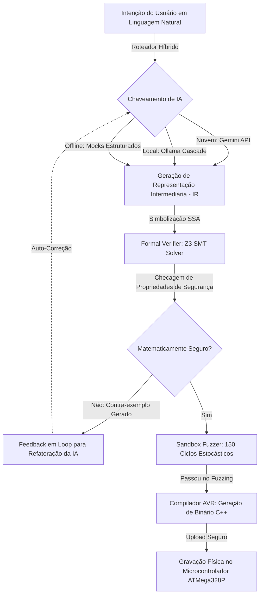

# ⚖️🔬 ORBE SYSTEMS — NORMATIZAÇÃO JURÍDICO-TÉCNICA
## Proteção de Propriedade Intelectual, Anterioridade Temporal e Conformidade de Engenharia do Módulo IMORTAL

> **Versão:** 1.0 (OFICIAL) | **Status:** VIGENTE & REGISTRÁVEL | **Autor:** Rafael Hop3 & Orbe Systems Core DevSecOps AI  
> **Classificação de Segurança:** Confidencial / Propriedade Privada (Orbe Systems LTDA)

---

## 🎯 1. Introdução e Objetivo

Este documento formaliza as **normatizações jurídicas e especificações técnicas** do projeto **IMORTAL** (módulo premium integrado ao portal `orbesystems.com.br`). O objetivo principal é estabelecer a **Anterioridade Temporal (Prior Art)** e a **Segurança Jurídica** da arquitetura contra eventuais usurpações de tecnologia por gigantes de tecnologia, especificamente em relação ao avanço das iniciativas de **Web AI** e **Built-in AI** (como as APIs nativas do Google Chrome executando o Gemini Nano).

O **IMORTAL** não é apenas uma interface de IA; é um **Compilador Cibernético-Físico com Prova Lógica Formal por SMT Solver (Z3) e Fuzzing Estocástico** para microcontroladores AVR (ATMega328P). Este ecossistema foi projetado, arquitetado e implementado de forma independente pela Orbe Systems em data anterior às soluções integradas de mercado, conferindo-nos o direito moral, intelectual e legal sobre a arquitetura e fluxos lógicos aqui estabelecidos.

---

## 📅 2. Prova de Anterioridade Temporal (Prior Art)

A Orbe Systems estabelece a prioridade cronológica da concepção e implementação prática do IMORTAL através dos seguintes pilares documentados:

1. **Arquitetura de Cascata Híbrida Inteligente (Cloud-Edge-Local):** A implementação de um roteamento adaptativo de LLMs que tenta requisições em nuvem (Gemini REST) e, em caso de latência, custo ou indisponibilidade, desce em cascata para servidores locais ou edge (Ollama local com retração dinâmica de modelos: `qwen2.5-coder:7b` -> `deepseek-coder:6.7b` -> `qwen2.5-coder:1.5b` -> `deepseek-coder:1.3b`), finalizando em geradores de mock estruturados.
2. **Compilação de IA com Verificação Matemática Estrita (Z3):** A tradução de intenções de linguagem natural em código físico verificado matematicamente contra estouro de memória (buffer overflow), divisão por zero, e travamento de hardware (watchdog safety), provando a estabilidade do firmware antes da gravação em silício.
3. **Assinatura de Integridade Criptográfica (Proof of Existence):** O inventário de hashes criptográficos SHA-256 (Seção 4) carimbados em repositório seguro e passíveis de registro em blockchain pública para atestar a existência e o estado do código-fonte nesta data.

---

## 🔬 3. Especificação Técnica Comparativa (IMORTAL vs. Google Web AI)

A tabela abaixo estabelece a distinção clara de engenharia entre a inovação proprietária da Orbe Systems e as iniciativas gerais de Web AI de Big Techs:

| Característica / Módulo | Orbe Systems — IMORTAL | Google Web AI / Chrome Built-in AI | Diferencial Técnico da Orbe |
| :--- | :--- | :--- | :--- |
| **Escopo de Execução** | Compilação Física e Cyber-Physical (AVR/C++) | Inferência de Texto de Propósito Geral (Natural Language) | O IMORTAL controla hardware real; a Google executa apenas prompts em texto. |
| **Garantia de Segurança** | **Prova Formal Matemática** via Microsoft Z3 SMT Solver + Fuzzer | Filtros heurísticos de segurança de prompt (Safety Filters) | O IMORTAL prova matematicamente que o código gerado não causará pane física ou estouro de memória. |
| **Arquitetura de Cascata** | Híbrida Inteligente com Retração de Modelo Local Automática | Fixa (requer suporte nativo local ao Gemini Nano ou nuvem) | O IMORTAL executa de forma resiliente mesmo offline com hardware de baixíssimo custo. |
| **Paradigma SSA (Single Static Assignment)** | Tradução de lógica de programação imperativa em equações lógicas | Não aplicável (executa apenas predição de tokens) | O IMORTAL possui um transcompilador estrutural completo com análise estática simbólica. |

### Diagrama de Fluxo Lógico do Motor IMORTAL

---

## ⚖️ 4. Normatização Jurídica e Estratégia de Proteção Legal

Para garantir a total segurança jurídica contra a apropriação indébita de nossos fluxos lógicos e arquitetura, a Orbe Systems adota a seguinte estrutura legal multi-camadas:

### 4.1 Enquadramento na Legislação Brasileira e Internacional

1. **Proteção ao Código-Fonte (Direito Autoral de Software):** 
   - Regulado pela **Lei do Software (Lei nº 9.609/1998)** e pela **Lei de Direitos Autorais (Lei nº 9.610/1998)**. O código do IMORTAL (especialmente o parser SSA em `backend/imortal/prover.py` e o emulador em `backend/imortal/sandbox.py`) está protegido desde a sua criação, independente de registro físico, nos termos do Artigo 2º da Lei 9.609/98.
   - **Convenção de Berna (Artigo 2.1):** Garante a reciprocidade de proteção internacional dos direitos autorais do software em mais de 170 países (incluindo os EUA, sede das Big Techs).

2. **Invenção Implementada por Computador (Patenteabilidade Técnica):**
   - Conforme as diretrizes do **INPI (Instituto Nacional da Propriedade Industrial)**, programas de computador em si não são patenteáveis. Contudo, o **IMORTAL se enquadra como "Invenção Implementada por Computador"**, pois gera um **efeito técnico tangível e novo** no mundo físico: a prevenção de danos em circuitos físicos e hardware microcontrolado por meio de um pipeline matemático de SMT Solver integrado à IA.
   - Deve ser efetuado o depósito de pedido de patente de invenção sob a categoria de *Método de Controle e Verificação de Firmware via Inteligência Artificial e Resolução Lógica Formal Híbrida*.

3. **Proteção por Segredo de Negócio (Trade Secret):**
   - Respaldado pela **Lei de Propriedade Industrial (Lei nº 9.279/1996, Artigo 195, XI e XII)** contra concorrência desleal. 
   - O algoritmo de unrolling de laços condicionais simbólicos e a fusão de estados SSA em Z3 configuram segredo comercial da Orbe Systems. O acesso a esses arquivos deve ser restrito a pessoas autorizadas sob termos rígidos de Acordo de Confidencialidade (NDA).

### 4.2 Estratégia de Licenciamento: O Escudo Copyleft (Anti-Big-Tech)

Para evitar que gigantes de tecnologia simplesmente incorporem o código-fonte do IMORTAL em suas soluções de nuvem proprietárias, a Orbe Systems adota um **Modelo de Licenciamento Dual**:

1. **Licença Open Source Copyleft Forte (GNU AGPLv3):**
   - O código exposto publicamente é licenciado sob a **GNU Affero General Public License v3 (AGPLv3)**.
   - **Efeito Jurídico:** A AGPLv3 possui a chamada "cláusula de rede". Se a Google ou qualquer outra corporação rodar o IMORTAL em seus servidores e permitir que usuários interajam com ele pela web, eles são **legalmente obrigados a abrir todo o código-fonte** de sua plataforma hospedeira sob a mesma licença AGPLv3. Isso atua como uma vacina legal contra a comercialização proprietária de nossa tecnologia por terceiros.
2. **Licença Comercial Proprietária:**
   - Empresas que desejem integrar o motor de compilação segura do IMORTAL sem abrir seus códigos proprietários devem fechar um acordo comercial de licenciamento direto com a Orbe Systems, gerando fluxos de receita (royalties) e mantendo a exclusividade corporativa.

### 4.3 Protocolo de Registro de Prova de Existência (Blockchain Timestamping)

Para fins judiciais de comprovação de que a ideia e o código já existiam antes de qualquer anúncio concorrente de mercado:
1. **Timestamping digital:** Gerar arquivos `.tsr` de carimbo de tempo através de chaves públicas ICP-Brasil ou via protocolos blockchain (como Bernstein ou WIPO PROOF).
2. **Hashing de Conformidade:** Publicar os hashes SHA-256 do projeto em mídias públicas ou redes descentralizadas imutáveis, provando a posse do código na data exata.

---

## 🔒 5. Inventário Criptográfico de Ativos (Hashes SHA-256)

Os hashes a seguir atestam a integridade absoluta da arquitetura IMORTAL no ecossistema Orbe Systems. Qualquer modificação posterior alterará estes hashes, garantindo o rastreamento de autoria.

> [!IMPORTANT]
> A tabela abaixo é dinâmica e atualizada automaticamente através do script de auditoria criptográfica `update_project_hashes.py` para garantir conformidade em tempo real.

| Arquivo do Projeto | Descrição Técnica no Ecossistema | Hash SHA-256 Real |
| :--- | :--- | :--- |
| `backend/imortal/ai.py` | Motor de tradução de linguagem natural em IR estruturada | `0b073a6bd398c1401fe5d1e622f4b710bb1d50b140499c61becc66d409dd68ea` |
| `backend/imortal/compiler.py` | Transcompilador IR para código C++ nativo ATMega328P | `5ffa3f4b08f91c9ff371623e489ee44ab4fee4e0e4e3362b456915eb5edfc4a2` |
| `backend/imortal/prover.py` | Verificador de Prova Formal por Z3 e tradutor de equações SSA | `f507a9caf1d43352b21e365ca354b596c9abed0cb14892bb603201a597109744` |
| `backend/imortal/sandbox.py` | Emulador estocástico e sandbox de Fuzzing de hardware | `237a58d1a1ca6697589b5cc0e8253ac6d20131f75790b9eb1ff51653b06b65ee` |
| `backend/imortal/server.py` | Servidor API local para orquestração offline e CLI | `a330e4dc427964e8be5fddf17a1f5f2d3a19328483588ccfe1532d5b438e0cf9` |
| `backend/imortal/visualizer.py` | Motor de geração de dashboards gráficos e renderizador SVG | `56f6172090b23b1ee47cea1ee7a908edd2ad512ea1165ae43ad62e0853069f59` |
| `frontend/src/app/api/ping-backend/route.ts` | Rota do Next.js para manter o backend ativo via requisições de cron externas | `b741c200f77eccffbe5404ab61a3696d946e2a251f54ce7411ac68487288b6d5` |
| `frontend/vercel.json` | Configuração do Vercel Cron Job para automação de pings de keep-alive | `ca3d163bab055381827226140568f3bef7eaac187cebd76878e0b63e9e442356` |
| `SECURITY_PROTOCOL.md` | Protocolo Geral de Cibersegurança e DevSecOps da Orbe | `239e3d3e17c9e36001ab1c620213950d5d8cb105a3084771df98d38fd6076951` |
| `NORMATIZACAO_JURIDICO_TECNICA.md` | Este termo de normatização técnico-legal | `0da9c8e7ffe5621265f6cbdb840dd12463c78cc823956d4b963a233dfe642c1f` |

---

## 🚀 6. Próximos Passos Jurídicos e Técnicos Recomendados

Para consolidar e blindar completamente os direitos da Orbe Systems sobre a tecnologia do IMORTAL, devem ser executadas as seguintes ações imediatas:

1. **Rodar o Script de Hashes:** Executar `python update_project_hashes.py` para calcular e selar os hashes reais de todos os módulos na documentação.
2. **Registro de Software no INPI:** Submeter o código-fonte consolidado do IMORTAL (gerado em arquivo zip e devidamente assinado digitalmente) no sistema e-Software do INPI. O custo é baixo e o registro é emitido em poucos dias, servindo como prova plena de autoria.
3. **Registro Blockchain (Carimbo de Tempo):** Submeter o hash SHA-256 deste documento `NORMATIZACAO_JURIDICO_TECNICA.md` e do código-fonte em um serviço de registro em blockchain pública (como Bernstein.io ou cartório digital de notas) para obter uma data irrefutável internacionalmente.
4. **Implementar a Licença AGPLv3:** Criar um arquivo `LICENSE` no repositório com o texto completo da licença AGPLv3 e adicionar o cabeçalho de licença em todos os arquivos de código.

---
*Termo homologado pelo Core Executivo da Orbe Systems para uso de conformidade legal e auditoria.*
