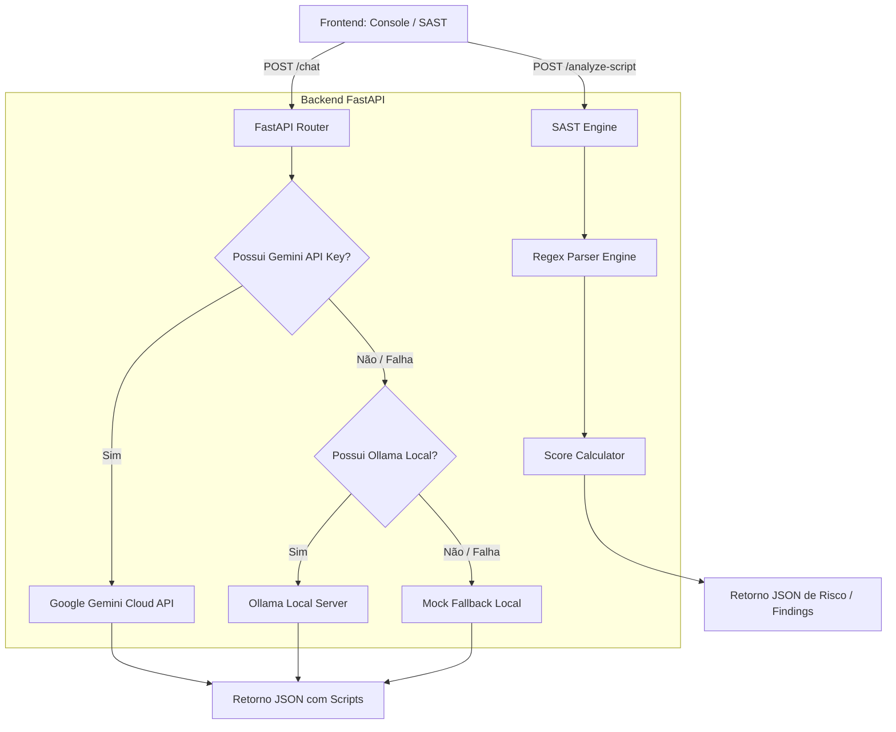
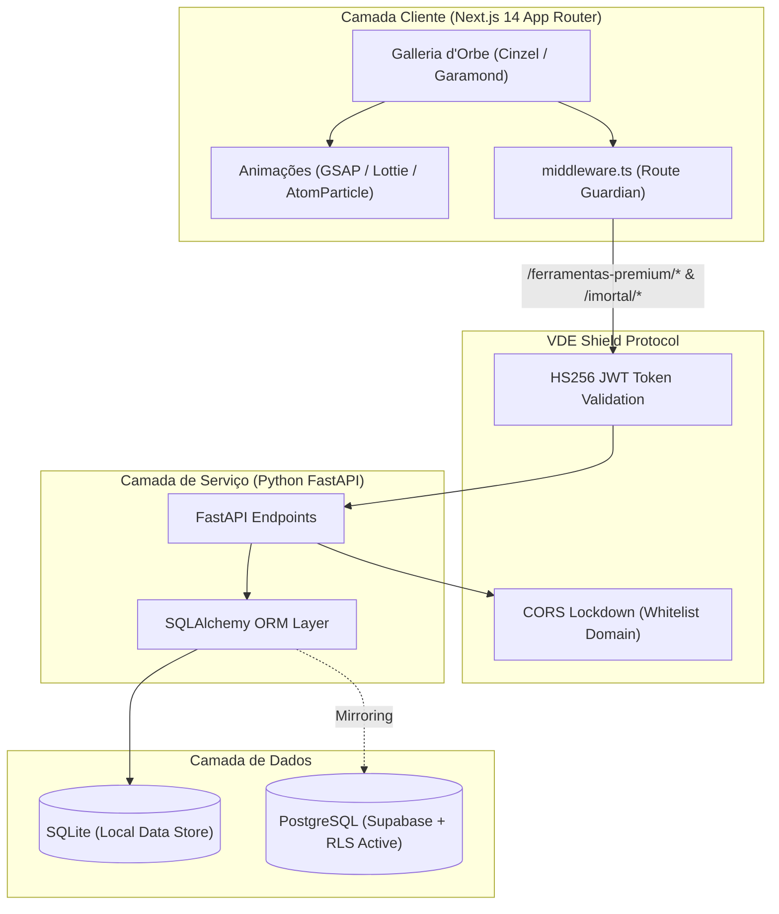

# 📂 Organização dos Ativos — OrbePSShield (PowerShell Shield Bot)

Este documento centraliza e organiza os ativos técnicos do **OrbePSShield**, divididos em diagramas de arquitetura, código estrutural em Python e fórmulas matemáticas de cálculo de risco.

---

### 1.1 Fluxo Híbrido de Resolução de IA (OrbePSShield)

O diagrama abaixo ilustra o fluxo de processamento de solicitações de chat e auditorias estáticas de código (SAST) dentro do ecossistema híbrido da Orbe Systems:



### 1.2 Mapeamento do Fluxo de Dados e Barreiras (VDE Shield Protocol)



---

## 🐍 2. Código Estrutural em Python

O núcleo estrutural da análise de vulnerabilidade está localizado em `backend/routes/powershell_bot.py`. Abaixo está o código de validação SAST e o chaveamento híbrido de IA:

### 2.1 Análise Estática por Regex (SAST Engine)
```python
# Trecho de validação e redução de score por regras de conformidade
findings = []
score = 100

# 1. Checar por Invoke-Expression / iex
if re.search(r"\b(iex|invoke-expression)\b", content, re.IGNORECASE):
    findings.append({
        "severity": "CRITICAL",
        "rule": "Avoid-InvokeExpression",
        "description": "Uso de 'Invoke-Expression' ou seu alias 'iex' detectado. Isso permite execução de código arbitrário e facilita injeção de scripts (RCE).",
        "line": "Detectado no corpo do script"
    })
    score -= 40
    
# 2. Checar por Set-ExecutionPolicy Bypass
if re.search(r"executionpolicy\s+bypass", content, re.IGNORECASE):
    findings.append({
        "severity": "HIGH",
        "rule": "ExecutionPolicy-Bypass-Override",
        "description": "Script configura a Execution Policy global do host para 'Bypass'.",
        "line": "Detectado no script"
    })
    score -= 25
```

### 2.2 Roteador Híbrido de Execução de IA
```python
# Chaveamento automático entre APIs de Nuvem e Servidores Locais
from imortal.config import GEMINI_API_KEY, GEMINI_MODEL, PRODUCTION_MODE

# 1. Tenta Gemini (Cloud API)
if (PRODUCTION_MODE and GEMINI_API_KEY) or settings.GEMINI_API_KEY:
    try:
        url = f"https://generativelanguage.googleapis.com/v1beta/models/{settings.GEMINI_MODEL}:generateContent?key={settings.GEMINI_API_KEY}"
        # Request HTTP post ...
        return json.loads(text_response)
    except Exception as e:
        logger.error(f"Falha Gemini Cloud: {e}. Executando fallback...")

# 2. Tenta Ollama (Local / Self-hosted) com cascata de modelos para hardware de baixo custo
try:
    from imortal.config import OLLAMA_HIGH_LEVEL_MODEL
    models_cascade = [OLLAMA_HIGH_LEVEL_MODEL, "qwen2.5-coder:1.5b", "deepseek-coder:1.3b"]
    # Executa o loop de retração de tamanho de modelo caso falhe por timeout ou memória
    for model_name in models_cascade:
        try:
            return await call_ollama_json(
                system_instruction=POWERSHELL_SYSTEM_PROMPT,
                user_prompt=prompt,
                model_name=model_name
            )
        except Exception:
            continue
except Exception as ollama_err:
    logger.error(f"Falha geral no Ollama Local: {ollama_err}")
```

---

## 🧮 3. Fórmulas de Cálculo e Deduções de Risco

O cálculo da nota de integridade e segurança do script PowerShell é determinado por deduções a partir do score base de 100 pontos:

### Fórmula Geral
$$S = \max\left(0, 100 - \sum_{i=1}^{N} D_i\right)$$

Onde:
*   $S$ é a nota de segurança final (Security Score).
*   $D_i$ representa a penalidade associada a cada violação estática encontrada.

### Classificação de Risco Operacional ($R$)
$$R = \begin{cases} 
\text{LOW}, & \text{se } S \ge 85 \\
\text{MEDIUM}, & \text{se } 60 \le S < 85 \\
\text{HIGH}, & \text{se } 35 \le S < 60 \\
\text{CRITICAL}, & \text{se } S < 35 
\end{cases}$$

### Tabela de Penalidades ($D_i$)
*   **Arbitrary Execution Block (`iex`)**: $D = 40$
*   **Active Defense Shutdown (`Disable-NetFirewall`)**: $D = 35$
*   **Global Policy Override (`ExecutionPolicy Bypass`)**: $D = 25$
*   **Hardcoded Plaintext Secret (`password = "..."`)**: $D = 20$
*   **Insecure Download protocol (`http://`)**: $D = 10$
*   **Unsafe Resource Deletion (`Remove-Item -Force`)**: $D = 5$

---

## 🔒 4. Assinaturas de Integridade (Hashes SHA-256)

Os hashes SHA-256 abaixo atestam a integridade e conformidade de cada componente gerado na versão final do **OrbePSShield**:

| Arquivo | Hash SHA-256 |
| :--- | :--- |
| `backend/routes/powershell_bot.py` | `5e20a3479db4224724b22cdba0893b3befe40aa2673270446c2976eec6ade6eb` |
| `backend/main.py` | `f824cab1b85788832d81e4ba7f5aa45e4bfa95ec95daa65569f41b158ff8d18f` |
| `frontend/src/app/ferramentas-premium/powershell-bot/page.tsx` | `86904dd50564ba25177f21ead0cd2b8e63c9c91304621f3f20fa317d2692faff` |
| `frontend/src/components/Header.tsx` | `3f25fab9d85cd40b0dcb2727e5d9d11f5b8b82f138e427b9ae7d47b361b1a0ec` |
| `frontend/src/app/(categories)/cyber-security/page.tsx` | `6788a4bb311aeb24ac91b7c70d13ee89d882b94e23d8276c7151f7c2398cc2bd` |
| `SECURITY_PROTOCOL.md` | `239e3d3e17c9e36001ab1c620213950d5d8cb105a3084771df98d38fd6076951` |
| `ORGANIZACAO_ATIVOS.md` | `PENDENTE_POS_COMMIT` |

